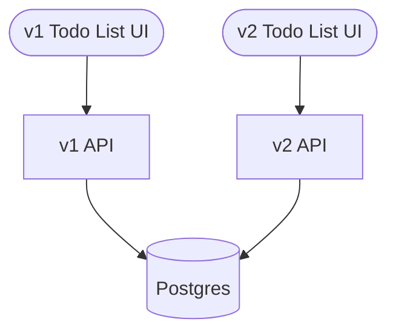

# `pgroll` Demo

An example application to demonstrate the value of `pgroll`.

## Architecture

The demo application is a 'todo list' application, built as a simple two-tier web app:



v1 of the application allows adding new items to the todo list. v2 requires an assignee for each item.

`pgroll` allows v1 and v2 of the database schema to exist at the same time, making possible a zero downtime deployment of v2.

## Prerequisites

* Docker
* `pgroll`

Install `pgroll` by following the [installation instructions](https://github.com/xataio/pgroll/blob/main/README.md#installation) in the project [README](https://github.com/xataio/pgroll/blob/main/README.md).

## Running

Run the demos with:

```
make demo
```

or

```
make demo2
```

This will start three containers:

1. Postgres on host port 5432.
2. v1 of the demo application on host port 8080.
3. v2 of the demo application on host port 8081.

### Applying migrations

The first migration is automatically applied by `make demo`.

* Apply the second migration (necessary for v2 to function):

```
pgroll start sql/02_add_assignee_column.json
```

Or, if you ran `demo2`:

```
pgroll start sql/02_check_assignee.json
```

## Development

Run the API and the frontend:

```
make run
cd web
npm run start
```

This will run the API on port 8080 and a development build of the frontend on port 1234.

To start fresh, remove the API and postgres containers and volumes with:

```
make clean
```

## Links

- [Migrations workshop](https://www.youtube.com/watch?v=-1aO6UznfI0) - A Xata migrations workshop that includes includes a runthrough of this demo.
